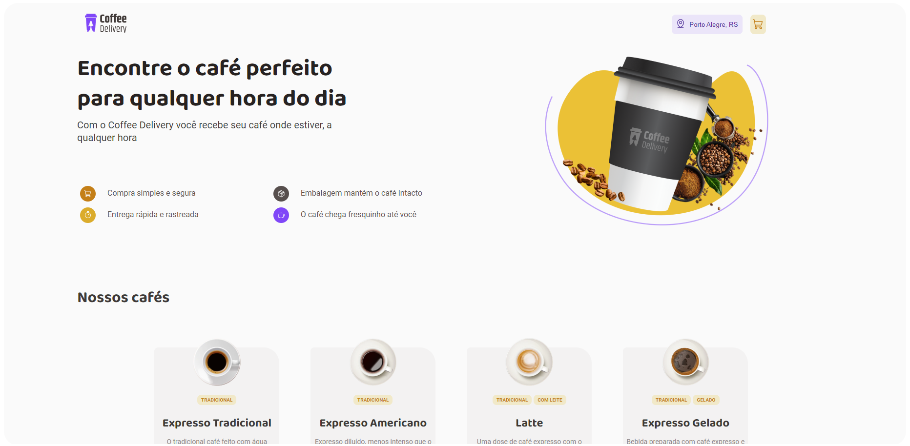

# Coffee-delivery

Second challenge of the ReactJS trail of Ignite/Rocketseat.

A prototype of a small catalogue of cafes, for an online store.


## Getting started

#### Download/clone the repository

```http
  npm install
```

It will run on localhost. No server/database necessary, its just front-end example.
